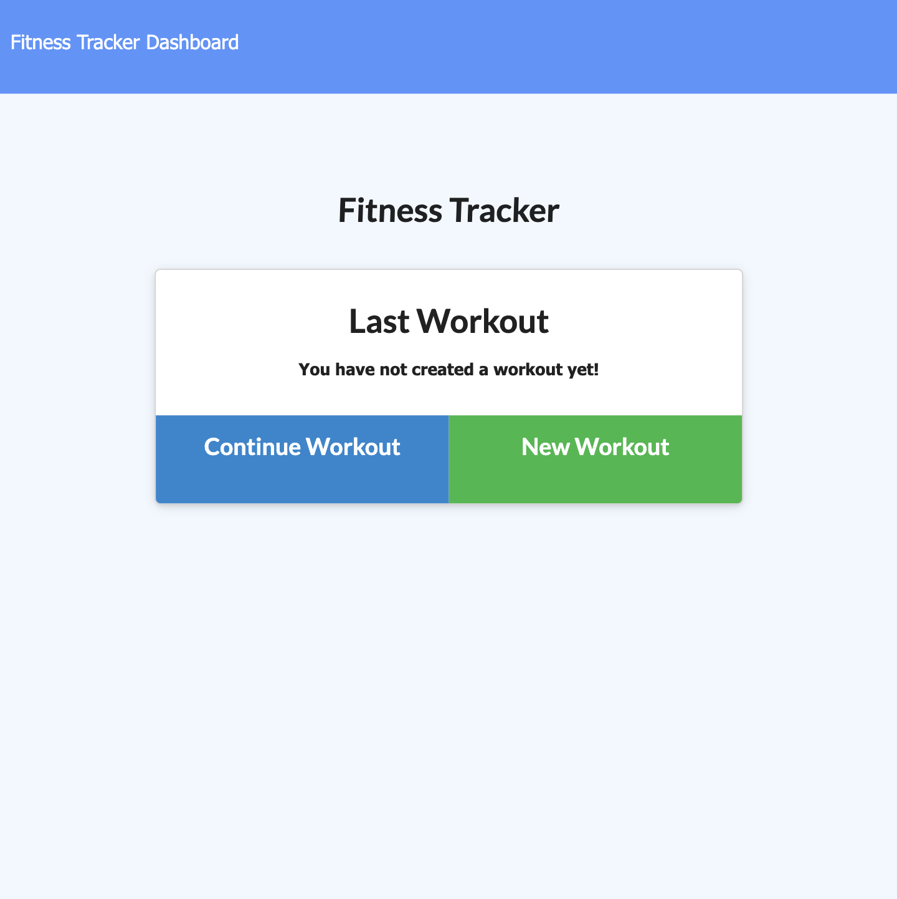
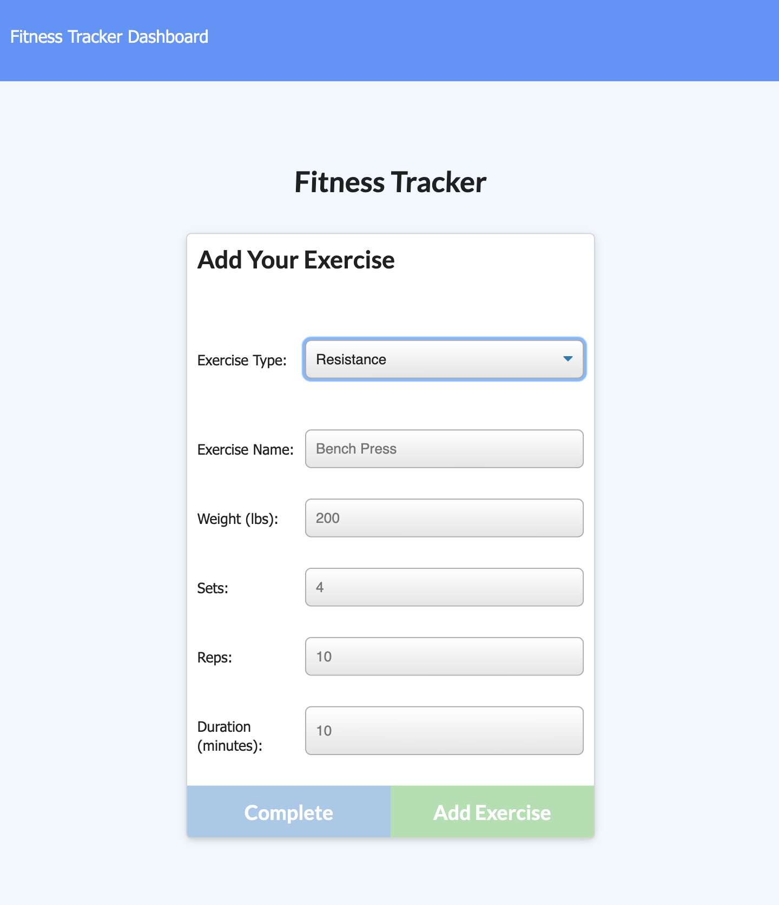
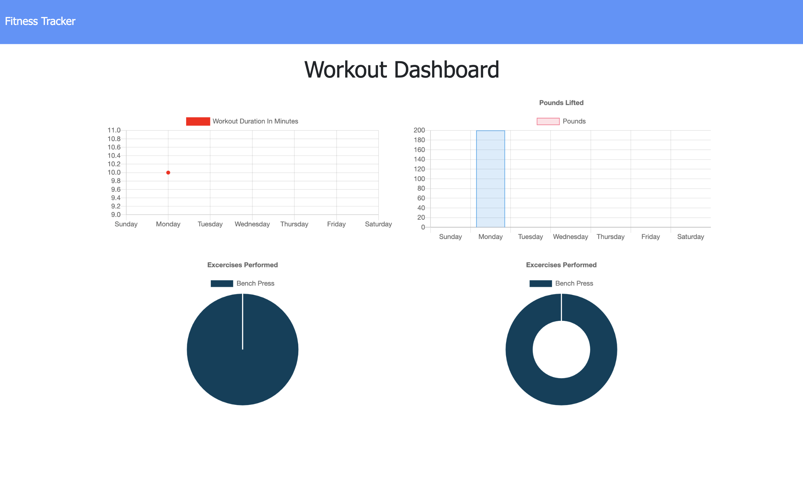

# Fitness Tracker

## Table of Contents (Optional)
* [Description](#Description)
* [Instructions](#Instructions)
* [Questions](#Questions)
* [License](#License)

---

## Description

The Fitness Tracker is a web application that allows the user to track exercises throughout the week. The user can then visually see on a series of graphs data summaries of their workouts including total pounds lifted and total distance ran/walked.

---

## Instructions

1. Begin by clicking on the "New Workout" button

2. You'll be taken to the "Add Your Exercise" page

3. Select from the drop down menu which type of exercise you would like to add
4. Enter name, weight, sets, reps and duration
5. Click "Complete" if you are down or "Add Exercise" if you would like to add another exercise to your workout

6. Click on the "Dashboard" link in the header to proceed to the stats page

7. Here you can view metrics from previous workouts and exercises.

---

## Questions

* My github: https://github.com/zehrl
* Email me at zehrl315@outlook.com if you have any questions.

---

## License

© 2021 Logan J. Zehr

Permission is hereby granted, free of charge, to any person obtaining a copy of this software and associated documentation files (the "Software"), to deal in the Software without restriction, including without limitation the rights to use, copy, modify, merge, publish, distribute, sublicense, and/or sell copies of the Software, and to permit persons to whom the Software is furnished to do so, subject to the following conditions:

The above copyright notice and this permission notice shall be included in all copies or substantial portions of the Software.

THE SOFTWARE IS PROVIDED "AS IS", WITHOUT WARRANTY OF ANY KIND, EXPRESS OR IMPLIED, INCLUDING BUT NOT LIMITED TO THE WARRANTIES OF MERCHANTABILITY, FITNESS FOR A PARTICULAR PURPOSE AND NONINFRINGEMENT. IN NO EVENT SHALL THE AUTHORS OR COPYRIGHT HOLDERS BE LIABLE FOR ANY CLAIM, DAMAGES OR OTHER LIABILITY, WHETHER IN AN ACTION OF CONTRACT, TORT OR OTHERWISE, ARISING FROM, OUT OF OR IN CONNECTION WITH THE SOFTWARE OR THE USE OR OTHER DEALINGS IN THE SOFTWARE.